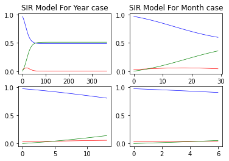

# Result of file


###### (This image is result of file SIR.py)

# Consider 
This is result of SIR.py file which show predictive value of information from parameters (ndays, beta, and gamma) depending on those factors, When some parameter change will be change a result of graph this  

If you just use some predict, you can use this code for predict a result of occurrence
```
ndays = 7
dt = 1.0
beta = (1/3)
gamma = (1/4.0)
S= np.zeros(ndays)  # Susceptible
I= np.zeros(ndays)  # Infected
R= np.zeros(ndays)  # Recovered
t= np.arange(ndays)*dt # Time
#t= np.arange(np.datetime64('2022-07-23'), np.datetime64('2022-08-21'))
I[0]= 0.03
S[0]= 1. - I[0]
R[0]= 0.

for i in range(ndays-1):
  S[i+1]=S[i] - (beta*S[i]*I[i])*dt
  I[i+1]=I[i] + (beta*S[i]*I[i] - gamma*I[i])*dt
  R[i+1]=R[i] + gamma*I[i]*dt

fig = plt.figure(1); fig.clf()
plt.plot(t,S, 'b', lw=3, label='Susceptible')
plt.plot(t,I, 'r', lw=3, label='Infected')
plt.plot(t,R, 'g', lw=3, label='Recovered')

fig.legend(); plt.title("SIR Model For Month case", fontdict=font)  
plt.xlabel('Time is start on 23 Jul to 30 Jul. (Days)',fontdict=font)
plt.ylabel('Fraction of Population from \u03B2 :1/3 and \u03B3 :1/4',fontdict=font)

```
# Update now
-  ***[11/11/22]*** None
# Bugs and problems
-  ***[11/11/22]*** Algorithm this not great to using a Big Data because of you look on my code will know that large code which makes slowly process 
